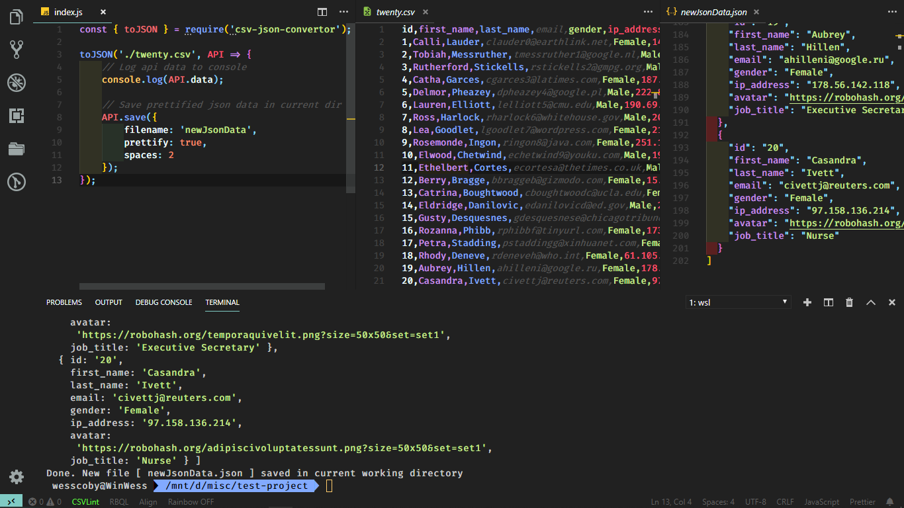

[](https://www.npmjs.com/package/csv-json-convertor)
[](https://www.npmjs.com/package/csv-json-convertor)


# Overview
Csv-json-convertor, as its name implies, is a simple *csv-json* conversion tool. You can use it to easily convert csv files to json objects and/or files, as well as the other way around (convert json files to csv).

# Installation
**Install via npm**: `npm install csv-json-convertor` <br>
[](https://npmjs.org/package/csv-json-convertor)


# Usage
After installing, import and use in your project as follows:
### CSV to JSON
```js
// require destructured toJSON function
const { toJSON } = require('csv-json-convertor');

// convert csv file
toJSON('path/to/csvFile.csv', api => {
    // log or use object (result from the conversion)
    console.log(api.data); 
    // save new .json file (./csvFile.json by default) to current directory
    api.save() 
});
```

You can specify save options such as `filename`, `prettify` and `spaces` as in the following examples <br>
By default: <br>
`filename`: name of the csv file <br>
`prettify`: false <br>
`spaces`: 1
```js
// filename
toJSON('path/to/csvFile.csv', api => {
    const options = {
        filename: newJsonFile
    };
    api.save(options); 
    // Output: newJsonfile.json, not prettified
}); 

// filename, prettify 
toJSON('path/to/csvFile.csv', api => {
    const options = {
        filename: newJsonFile,
        prettify: true
    };
    api.save(options); 
    // Output: newJsonFile.json, prettified using a spacing of 1
}); 

// filename, prettify, spaces
toJSON('path/to/csvFile.csv', api => {
    const options = {
        filename: `newJsonFile`,
        prettify: true,
        spaces: 2
    };
    api.save(options); 
    // Output: ./newJsonFile.json, prettified using a spacing of 2
}); 
```


### JSON to CSV
The `toCSV` method is quite the opposite of `toJSON`
```js
// require destructured toCSV function
const { toCSV } = require('csv-json-convertor');

// convert csv file
toCSV('path/to/jsonFile.json', api => {
    // log or use string (result from the conversion)
    console.log(api.data);
    // save new .csv file (./jsonFile.csv by default) to current directory 
    api.save();
});
```
The save method accepts an `options` object which currently contains just one property, `filename`, with which you can specify the name of the new file to be saved.

```js
// filename
toJSON('path/to/jsonFile.json', api => {
    const options = {
        filename: `newCsvFile`
    };
    api.save(options); 
    // Output: ./newCsvFile.csv
}); 
```
# Contributing
I need help with writing a good documentation for this project. Also, any ideas or suggestions on new features, enhancements and performance improvement are very welcome. <br>
Feel free to contribute in anyway you can. 
